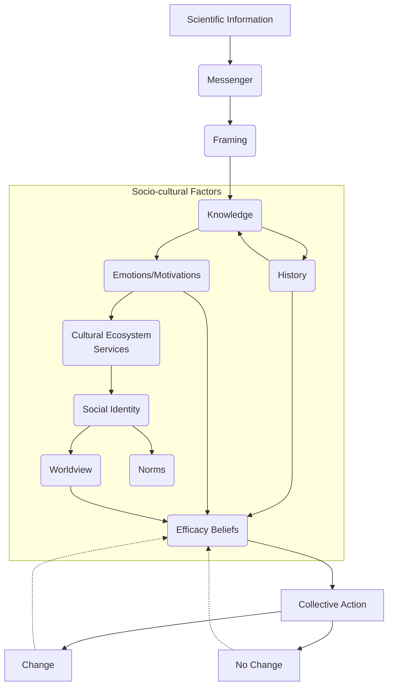
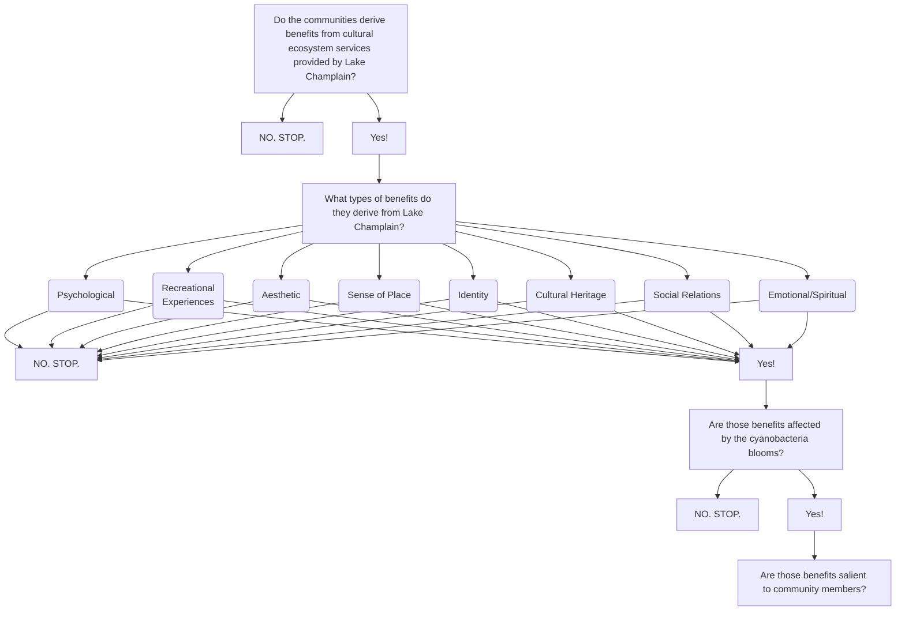

Diana Hackenburg
Homework #2
January 24, 2018 (updated 5/7/2018)
***
**Assignment:** Use Typora to create diagrams that explain the main hypotheses and/or mechanisms we will address with our thesis projects.  Add Markdown titles, formatting, and text, and develop a narrative to explain each figure the hypotheses they elaborate, and the expected outcomes of your experiments and observations. If you hit a wall in developing your hypotheses, try to write some text explaining what the issues are.

***
# How does scientific information influence community action?
For many years, scientists operated under the assumption that a lack of knowledge was the only thing preventing people from changing their behaviors. This "information deficit" model of information changing attitudes to influence behavior ruled most science communication efforts. However, we now know the underlying model is much, much more complicated. It's not just what we know but how we learn it, who we are, where we are, and so much more. In my research, I am interested in better understanding the links between scientific information and community action on environmental issues. Specifically, I am interested in socio-cultural factors that influence our understanding, and how cultural ecosystem services can serve as a potential link between nature, science, and people's concern. In this graph, I hypothesize that scientific information is first affected by the messenger (the who) and the framing (the how) before it interacting with an individual's socio-cultural factors. Those factors all come together in one's beliefs about the efficacy of taking action - can I make a difference?   

**Figure 1. The hypothetical flow of scientific information from messenger to collective action. **

I believe whether or not a person decides to take action depends highly on their efficacy beliefs, and whether or not the action creates change (material or non-material) feeds back in to their efficacy beliefs. This is a complicated model, but I hope to explore many parts of it through interviews, as well as an experimental study where we provide people with different framings and examine their intentions to act.

***

#How do cyanobacteria blooms impact nonmaterial human well-being?
Do the cyanobacteria blooms in Lake Champlain affect the benefits derived from cultural ecosystem services (CES) by communities near St. Albans Bay? If so, how? And what factors might affect if someone is affected? These are additional questions I hope to address through interviews, as well as through collecting stories. My hypothesis is that the blooms impact many different benefits derived from CES, but these impacts will be less salient to people and policymakers than impacts to material ecosystem services that are easily monetized. By understanding these additional impacts, I think communities can make a better case for increased action to improve water quality and prevent future blooms.

**Figure 2. Determining how cyanobacteria blooms in St. Albans Bay impact cultural ecosystem services.**

***
_Learn more about [this research](https://blog.uvm.edu/dhackenb/) and how it fits into a larger project exploring the links between harmful algal blooms (HABs) and human well-being._