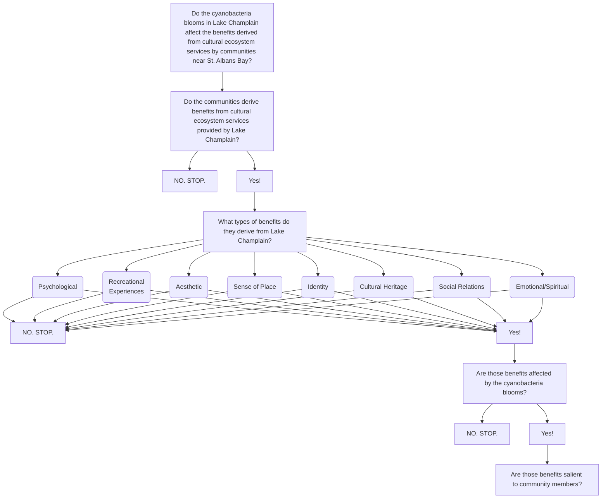

#How do cyanobacteria blooms impact nonmaterial human well-being?

```mermaid
graph TD
A[Do the cyanobacteria blooms in Lake Champlain affect the benefits derived from cultural ecosystem services by communities near St. Albans Bay?]
A --> B[Do the communities derive benefits from cultural ecosystem services provided by Lake Champlain?]
B --> C[NO. STOP.]
B --> D[Yes!]
D --> E[What types of benefits do they derive from Lake Champlain?]
E --> F(Psychological)
E --> G(Recreational<br/>Experiences)
E --> H(Aesthetic)
E --> I(Sense of Place)
E --> J(Identity)
E --> K(Cultural Heritage)
E --> L(Social Relations)
E --> M(Emotional/Spiritual)
F --> N[NO. STOP.]
F --> O[Yes!]
G --> N
G --> O
H --> N
H --> O
I --> N
I --> O
J --> N
J --> O
K --> N
K --> O
L --> N
L --> O
M --> N
M --> O
O -->P[Are those benefits affected by the cyanobacteria blooms?]
P --> Q[NO. STOP.]
P --> R[Yes!]
R --> S[Are those benefits salient to community members?]

```