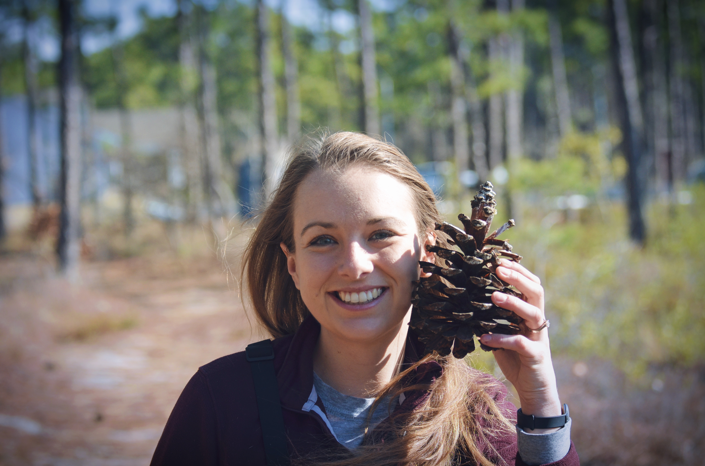

## Welcome to my GitHub project website.

My name is Diana Hackenburg and I am a PhD student in the Rubenstein School at the University of Vermont. I study the connections between human well-being and nature, as well as communication, education and community action related to the environment, specifically algal blooms. Before coming to Vermont, I worked as a science writer/editor with North Carolina Sea Grant, as well as with Triangle Land Conservancy, Virginia Department of Environmental Quality, and the Blue Ridge Land Conservancy. Check out [my other website](https://dianahackenburg.wordpress.com) or [email me](mailto:dhackenb@uvm.edu).
 
 
<h2>Presentation</h2>
My presentation will be on the [timevis](https://github.com/daattali/timevis) and [shiny](https://shiny.rstudio.com/) packages.

* [Html for timevis package](example_timevis.html)
* [Data file for timevis demo](timeline_example.csv)
* [R script for shiny demo](exampleapp/app.R)

##Homework
* [Homework 2](Homework2_Flowchart.html)
* [Homework 3](Homework3a.pdf)
* [Homework 4](homework4.html)
* [Homework 5](Homework5.html)
* [Homework 6](Homework6.html)
* [Homework 7/8](Homework7b.html)
* [Homework 9](Homework9.html)
* [Homework 10](Homework10.html)
* [Homework 11](Homework11.html)
* [Homework 12](Homework12.html)

##Helpful Links

[Bio 381 website](https://gotellilab.github.io/Bio381)